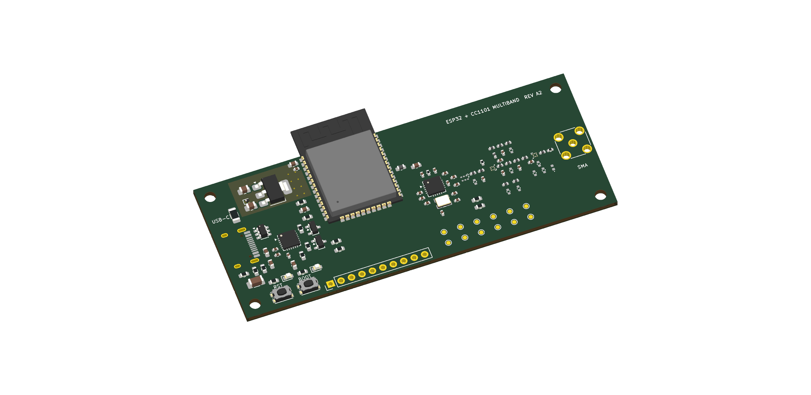
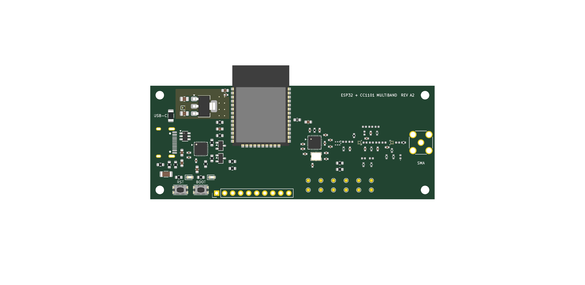

# ESP32 + CC1101 Multiband

A custom USB-C development board combining an **ESP32-WROOM-32E-N8** with an
integrated **CC1101** sub-GHz radio, software-selected RF paths, and a vertical
SMA antenna connector at the opposite end from USB-C.

**Rev A2 · Work in progress · Not ready to manufacture or sell**

The aim is to replace a separate ESP32 board, CC1101 breakout and jumper wires
with one purpose-built PCB. The first intended build is **five assembled
engineering prototypes**, after the pre-order checks are complete. Possible
product sales are a future option, not a launch announcement.

## Current design

*KiCad placement render—not a photograph of a built board. USB, SMA and some
RF parts lack complete 3D bodies. Their absence in the image does not mean
they were removed from the design.*

Top view and experimental routing

*The routing image is a separate experimental candidate, not the main placement
file or a fabrication package. Bottom and inner routes are not shown here.*

[Schematic SVG](output/svg-A2/esp32-cc1101-multiband.svg) ·
[Latest design report](reports/design-updates-A2-2026-09-22.md) ·
[Draft BOM](hardware/bom-draft.csv) · [Roadmap](ROADMAP.md)

## Building blocks and design inputs

### ESP32-WROOM-32E-N8 — controller and 2.4 GHz connectivity

*Stock module reference image: Espressif, linked from the manufacturer's site.
This is not a photo of the custom board or a guarantee of the N8 marking.*

The actual component is an Espressif module, not an entire stock development
board soldered onto another PCB. The selected N8 variant has 8 MB flash; its
ESP32 provides a dual-core processor, 2.4 GHz Wi-Fi and Bluetooth. Its PCB
antenna is separate from the sub-GHz SMA path. The antenna section extends
beyond the custom base board to preserve its keepout.
[Module datasheet](https://documentation.espressif.com/esp32-wroom-32e_esp32-wroom-32ue_datasheet_en.html).

Power/programming uses ESP32 development-board conventions: USB-to-UART,
automatic reset/boot control and manual BOOT/RESET buttons. This is not a
pin-compatible clone of a particular commercial DevKit.
[Espressif ESP32-DevKitC reference](https://docs.espressif.com/projects/esp-dev-kits/en/latest/esp32/esp32-devkitc/user_guide.html).

### Texas Instruments CC1101 — sub-GHz transceiver

*Representative package image: Texas Instruments. This is the IC package,
not a complete CC1101 antenna module; package markings may differ.*

The PCB integrates **CC1101RGPR** directly, with its crystal, bypass capacitors,
balun, switches and matching/filter components. TI specifies tuning ranges
of 300–348, 387–464 and 779–928 MHz. That does **not** make every frequency or
antenna equally usable or establish this board's RF performance.
[CC1101 product information and datasheet](https://www.ti.com/product/CC1101).

The separate [Amazon CC1101 module](https://a.co/d/01gplHzS) supplied by the
owner was a functional starting point. Its exact internal circuit and advertised
four-band performance have not been independently verified here. The switched
RF topology and initial component values also reference the
[M5Stack Cap CC1101 schematic](https://docs.m5stack.com/en/cap/Cap_CC1101).
This is a different implementation, not an endorsed M5Stack product.

### Supporting parts currently selected

| Function | Current design choice |
|---|---|
| USB-C | HRO TYPE-C-31-M-12, USB 2.0 connection |
| USB-to-UART | Silicon Labs CP2102N-A02-GQFN24 |
| 3.3 V regulator | AP7361C-33E-13; thermal capacity under review |
| Radio reference | Abracon ABM8, 26 MHz; load requires validation |
| RF selection | Two Infineon BGS13SN8 SP3T switches, GPIO-controlled |
| RF balun | B0310J50100AHF |
| Antenna connector | Amphenol 132134, vertical standard SMA female, 50 ohm |

See [third-party notices](THIRD_PARTY_NOTICES.md) for provenance, image credits
and license boundaries. Parts remain subject to sourcing, footprint and assembly
approval; the BOM is not an approved shopping list.

## Planned capabilities and features

| Feature | Planned behavior | Status |
|---|---|---|
| Four target bands | 315 / 433 / 868 / 915 MHz, one selected at a time | Not RF-validated |
| Software band switching | GPIO-operated RF switches; no DIP switches | Circuit and helper code drafted |
| Three RF branches | Dedicated 315 and 433 paths; shared 868/915 path | Matching, loss and isolation unmeasured |
| Single sub-GHz SMA | Vertical connector opposite USB-C | Placed; mechanical approval pending |
| USB-C power/programming | 5 V input, USB-to-UART flashing/logging | Captured; not bench-tested |
| Wi-Fi / Bluetooth | Available through the ESP32 module | Application integration planned |
| Developer controls | BOOT, RESET, LEDs and test pads | Included in draft |
| Expansion | Optional DNP 10-pin header | Included in draft |
| PCB | 90 × 36 mm base, four layers, nominal 1.6 mm | Stackup/impedance release pending |
| Safe bring-up | RF paths isolated; no transmit command | Implemented in initial firmware |

Band switching changes the **hardware path**. Future firmware must also set the
radio frequency/modem registers and operating limits. One CC1101 cannot listen
on all four bands simultaneously. Use an antenna suitable for the selected
band; a shared SMA does not imply a universal antenna.

There is no native USB, USB-PD, battery charger, finished RF application or
guaranteed protocol compatibility in this revision.

## What has actually been checked?

Snapshot: **2026-09-22**, KiCad 10.0.6. Design-file checks, not lab results.

| Check | Result |
|---|---|
| Schematic ERC | 0 reported violations |
| Main placement DRC | 0 reported violations; **217 unconnected items** |
| Targeted artifact checks | 115 / 115 passing |
| Separate routing candidate DRC | 0 reported violations; **23 unconnected items** |
| Candidate power routing | 35 segments below the 0.40 mm target need review |
| Parts selection | 63 / 81 populated positions have proposed exact parts |
| Physical boards tested | **None** |

Zero reported violations does not mean a working, connected or compliant board.
Manual RF/USB/clock routing, power/return-path review and impedance design remain
unfinished. The regulator has inadequate screening margin for an assumed
continuous 500 mA load. Low-band switch performance, shared upper-band matching
and crystal startup/frequency accuracy remain unverified.

[Raw reports](reports/) · [Verification checklist](docs/04-verification-plan.md) ·
[Routing, thermal and RF validation plan](docs/05-A2-routing-and-validation.md)

## Roadmap

1. **Design capture — substantially complete:** schematic, placement, draft
   BOM, local footprints, bring-up firmware and automated checks.
2. **Finish layout — in progress:** critical routing, full connectivity, exact
   parts, power architecture decision, mechanical and independent review.
3. **Five-board build — not ordered:** reviewed fabrication and assembly files,
   then separately approved prototype procurement.
4. **Bench and RF tuning — not started:** power/temperature, USB, crystal,
   per-band matching, harmonics and receive performance.
5. **Firmware/application — planned:** validated receive-first operation,
   controlled band changes and deliberately configured regional limits.
6. **Possible product — undecided:** hardware revision, compliance, enclosure,
   test fixtures, sourcing, support and commercial terms.

The [detailed roadmap](ROADMAP.md) uses acceptance criteria, not promised dates.
There is no release date, sales price, preorder or claim of certification.

## Open the project

Open `hardware/esp32-cc1101-multiband.kicad_pro` in **KiCad 10** for the main
placement and schematic. Open `hardware/A2-routing-candidate.kicad_pro`
separately for the unapproved routing experiment. Do not order either one.

Python generators are the editable source for this checkpoint. **Regenerating
placement overwrites the generated board; preserve manual routing first.**
See [rebuild instructions](hardware/REBUILD.md) and
[firmware instructions](firmware/bringup/README.md).

Initial firmware resets the CC1101, reads PARTNUM/VERSION over SPI and logs
results. It does not configure a receiver or transmitter and has not run on
physical hardware. Its plausibility check is not an identity or RF certification.

## AI disclosure

This project is developed with substantial assistance from **OpenAI Codex**
under the owner's direction. AI assisted with component research, schematic/PCB
generators, footprints, experimental routing, firmware, documentation and review.
Design images are KiCad renders/exports, not AI-generated product photographs.

AI output and automated checks can contain errors. They are not independent
engineering approval, bench validation or regulatory certification. No physical
prototype has been completed. Qualified human electrical/RF review remains a
release gate. See the [full AI disclosure](AI_DISCLOSURE.md).

## Licensing, commercial plans and safety

This initial publication uses the **[Public Review License](LICENSE)**:
non-commercial study/private evaluation is permitted; manufacturing, product
sales and other uses beyond its limited permissions require written permission.
Commercial rights are reserved while the owner's plans are undecided. This is
**source-available, not open-source/open hardware**. Third-party terms are
separate; see [notices](THIRD_PARTY_NOTICES.md). Obtain legal advice before
relying on the custom license for a commercial launch.

Use only with equipment and signals you own or are authorized to test. Tunable
frequencies are not automatically permitted transmit frequencies. Final use and
sale require applicable RF, EMC, product-safety and other compliance work. This
prototype is not for safety-critical applications. No manufacturer named here
endorses the project.
